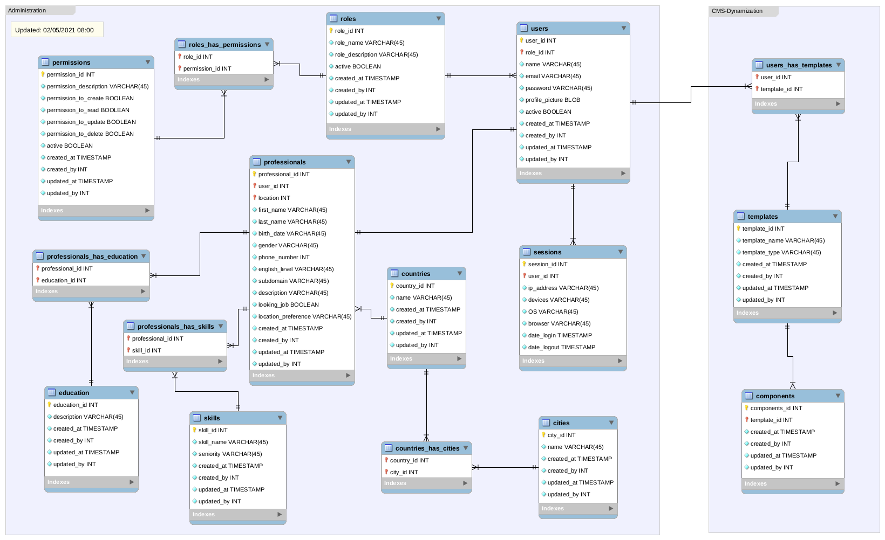
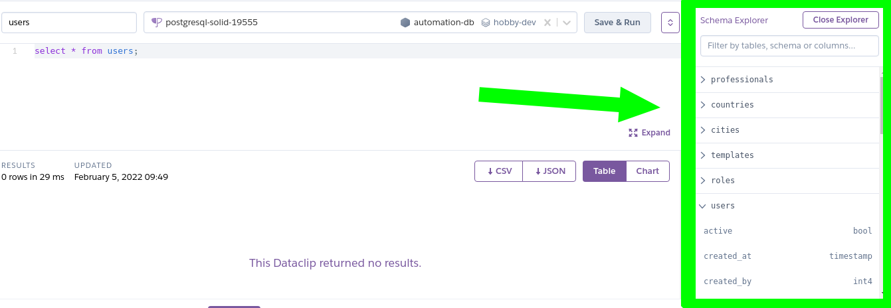

# Deployment of a PostgreSQL Database in Heroku 

This is how was created the database for Automation Cell in Heroku-Postgres.

Is written as instructions in order to replicate the process if necessary:

## 1 Set a Postgres Database
1. Create a new Heroku app.
2. Add a PostreSQL database:
	*  Navigate to the Resources tab in the header of your newly created app's dahsboard. 
	*  Then type Heroku Postgres into the Add-ons search field.When shown, select the suggested Heroku Postgres add-on from the dropdown.
	*  The next popup asks you to choose a pricing plan for the database. Select the Hobby Dev - Free plan and click Provision.
3. Access the database credentials (and connection URL)
	* Navigate to the Resources tab in your app's dashboard again and select the Heroku Postgres resource.
	* Now select the Settings tab in the header of that screen.
	* Here, you can click the View Credentials button to see the credentials of your PostgreSQL database.

## 2 Configure Heroku CLI

The Heroku Command Line Interface (CLI) makes it easy to create and manage your Heroku apps directly from the terminal. 
It’s an essential part of using Heroku.

* In case you dont have installed follow the instructons from Heroku site](https://devcenter.heroku.com/articles/heroku-cli)
* Login in your terminal.
	```
	heroku login
	```
* To test the conection you should introduce credentials:
	```
	heroku pg:psql postgresql-solid-19555 --app name_app
	```
	

## 3. Write a Postgres script to create the database tables.

According to ER diagmam write the sentences to create the database tables. ➡️ [automation_ER.sql]()



## 4. Send database schemas to Heroku from terminal

* Introduce the sentences to create the database tables:

```
heroku pg:psql --app automation-db < create_schema.sql 
```
Here you have a database in Heroku and it's ready to store data.


